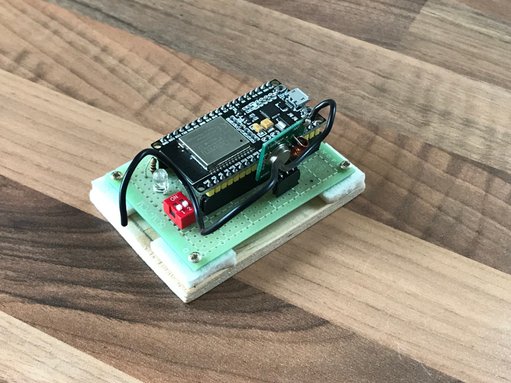

# What is it?

An ESP32 based controller for integrating common 433MHz sockets into Homekit.
The sockets are managed with a web interface.

# Hardware

</img>

The hardware setup is based on a ESP32 NodeMCU module. A 433MHz
transmitter is powered by the 5V output of the module and connected to GPIO26.

A DIP switch connects GPIO27 to ground and acts as a write protect switch ---
the configuration can only be changed when the switch is closed. A LED connected
to the same switch lights up when write protect is off.

# Firmware

## MCU

The firmware uses the excellent [HomeSpan](https://github.com/HomeSpan/HomeSpan)
library for homekit integration and the
[rc-switch](https://github.com/sui77/rc-switch) library for controlling the
sockets. It is organized as an
[ESP-IDF](https://docs.espressif.com/projects/esp-idf/en/latest/esp32/get-started/index.html)
project with the Arduino framework and the various Arduino libraries as
components.

## Web interface

The web interface is based on [React](https://reactjs.org) /
[TypeScript](https://www.typescriptlang.org) and builds with
[yarn](https://yarnpkg.com) and [Rollup](https://rollupjs.org/guide/en/). The
build is concatenated to a single HTML that is served by the ESP.

## Building

### 1. Prerequesites

The firmware currently builds with
[ESP-IDF](https://docs.espressif.com/projects/esp-idf/en/latest/esp32/get-started/index.html)
v4.4-beta1. In addition, you need [NodeJS](https://nodejs.org/en/) and
[yarn](https://yarnpkg.com) in order to build the web interface.

### 2. Submodules

After cloning the repository, check out the submodules by doing

```
$ git submodule init
$ git submodule update --recursive
```

### 3. NPM dependencies

Move into the `web` subdirectory and install the NPM dependencies with

```
$ yarn install
```

### 4. Build

Build and flash by running

```
$ idf.py build
$ idf.py flash
```

The build is set up to automatically build the web frontend.

# Usage

Follow the [HomeSpan](https://github.com/HomeSpan/HomeSpan) documentation to
configure wifi via the serial console. The initial hostname is `rfkit`. After
connecting the device to your wifi open http://rfkit.local in your browser and
change the configuration to your liking.

Sockets are configured in the web interface. In order to determine the RF codes
that are used by a socket you'll have to use a separate 433MHz receiver
connected to another MCU (or extend this project and open a pull request 😛).
Check out the [rc-switch](https://github.com/sui77/rc-switch) documentation and
examples for more information.

# License

You are free to use this software under the conditions of the LGPL 3.0.
